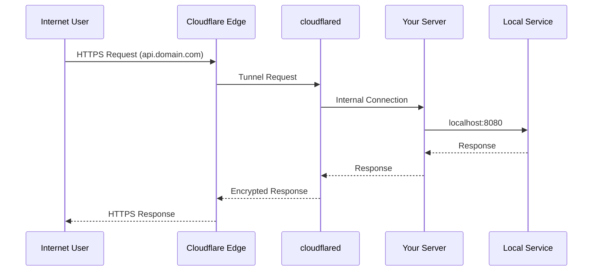
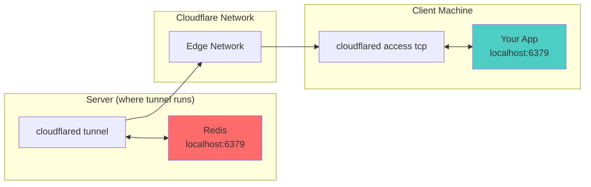

# Cloudflare Tunnel Manager

<p align="center">
  
</p>

<p align="center">
  
  
  
</p>

> A powerful CLI tool for managing Cloudflare Tunnels with systemd integration. Expose your local services to the internet securely through Cloudflare's edge network.

## Documentation

- **[Migration Guide](docs/MIGRATION.md)** — Upgrading from v0.2.0 (breaking changes)
- **[Cloudflare Basics](docs/CLOUDFLARE.md)** — What is Cloudflare, CDN, DNS, and Zero Trust
- **[Setting Up a New Domain](docs/SETUP-NEW-DOMAIN.md)** — Step-by-step: from domain purchase to running tunnels
- **[Technical Docs](docs/DOCS.md)** — Detailed reference for all features
- **[Changelog](CHANGELOG.md)** — Version history

> ⚠️ **Upgrading from v0.2.0?** See [Migration Guide](docs/MIGRATION.md) for breaking changes and step-by-step migration.

## Table of Contents

- [Overview](#overview)
- [How It Works](#how-it-works)
- [Features](#features)
- [Prerequisites](#prerequisites)
- [Quick Start](#quick-start)
- [Usage](#usage)
- [Tunnel Types Explained](#tunnel-types-explained)
- [Configuration](#configuration)
- [Examples](#examples)
- [Troubleshooting](#troubleshooting)
- [Security](#security)

---

## Overview

Cloudflare Tunnel Manager simplifies the creation and management of Cloudflare Tunnels. Instead of manually creating YAML configs, authenticating, setting up DNS records, and configuring systemd services, you can do it all with a single command.

### What is a Cloudflare Tunnel?

A Cloudflare Tunnel (formerly known as `cloudflared`) creates a secure, outbound-only connection from your server to Cloudflare's edge network. This allows you to expose local services to the internet without opening inbound ports on your firewall.

---

## How It Works



### Connection Flow

1. **You** run `./run.sh add --hostname api.domain.com --type http --service http://localhost:8080`
2. The script creates a Cloudflare Tunnel with a unique UUID
3. DNS CNAME record `api.domain.com` → `<uuid>.cfargotunnel.com` is created automatically
4. A systemd service `cloudflared@api-domain-com-http` is enabled and started
5. The `cloudflared` process connects OUTBOUND to Cloudflare's edge
6. When users visit `api.domain.com`, Cloudflare routes traffic through the tunnel to your local service

---

## Features

| Feature | Description |
|---------|-------------|
| 🚀 **One-Command Setup** | Create tunnels with a single command |
| 🗂️ **Zones** | Isolate tunnels by Cloudflare zone with `--zone` |
| 🔄 **Auto DNS** | Automatically creates CNAME records |
| ⚙️ **Systemd Integration** | Each tunnel as a separate service |
| 🚇 **Prompt Indicator** | Shows active zone in terminal (like Python venv) |
| 🔒 **Fail-Fast Validation** | Validates everything before starting |
| 🛡️ **Type Safety** | Validates protocol matches service URL |
| 📊 **Multi-Protocol** | Supports HTTP, HTTPS, SSH, and TCP |
| 🧹 **Clean Removal** | Removes tunnel, DNS, and service |

---

## Prerequisites

| Requirement | Installation |
|-------------|-------------|
| `cloudflared` | [Official Guide](https://developers.cloudflare.com/cloudflare-one/connections/connect-apps/install-and-setup/installation/) |
| `jq` | `sudo apt install jq` |
| `systemd` | Included with most Linux distros |
| `sudo` | Pre-installed on most systems |
| `dig` (optional) | Incluído no `bind-tools`/`dnsutils`. Fallback automático para `getent ahosts` (built-in) se ausente |
| Cloudflare Account | [Sign Up](https://dash.cloudflare.com/) |

### Install cloudflared

```bash
sudo wget -O /usr/local/bin/cloudflared \
  https://github.com/cloudflare/cloudflared/releases/latest/download/cloudflared-linux-amd64
sudo chmod +x /usr/local/bin/cloudflared
```

### Authenticate

```bash
cloudflared tunnel login
```

This opens a browser for authentication and creates `~/.cloudflared/cert.pem`.

### Systemd Template

Create `/etc/systemd/system/cloudflared@.service`:

```ini
[Unit]
Description=Cloudflare Tunnel (%i)
After=network-online.target
Wants=network-online.target

[Service]
Type=simple
User=YOUR_USERNAME
WorkingDirectory=/home/YOUR_USERNAME
ExecStart=/usr/local/bin/cloudflared tunnel --config /home/YOUR_USERNAME/.cloudflared/%i.yml run
Restart=on-failure
RestartSec=2
StartLimitIntervalSec=30
StartLimitBurst=5
StandardOutput=journal
StandardError=journal

# Reduce logging verbosity
Environment="CLOUDFLARED_LOGLEVEL=info"

# Security: systemd sandbox
NoNewPrivileges=true
PrivateTmp=true
RestrictAddressFamilies=AF_INET AF_INET6
RestrictRealtime=true
MemoryMax=256M
LimitNOFILE=65536

[Install]
WantedBy=multi-user.target
```

> ⚠️ Replace `YOUR_USERNAME` with your actual Linux username.

```bash
sudo systemctl daemon-reload
```

---

## Quick Start

### 1. Clone and Setup

```bash
git clone https://github.com/yourrepo/cf-tunnels.git
cd cf-tunnels

# Run the installer - it will do everything automatically!
./install.sh
```

The installer will:
- ✅ Install `cloudflared` if not present
- ✅ Authenticate with Cloudflare (opens browser)
- ✅ Create systemd template
- ✅ Set up the directory structure
- ✅ Create a global `cftunnel` command

> 💡 Tip: Run `./install.sh --help` for installation options.

### 2. Create Your First Tunnel

```bash
# For a web application (in default / legacy namespace)
./run.sh add --hostname api.example.com --type http --service http://localhost:3000

# For SSH access
./run.sh add --hostname ssh.example.com --type ssh --service ssh://localhost:22

# For a database (Redis, PostgreSQL, etc.)
./run.sh add --hostname redis.example.com --type tcp --service tcp://localhost:6379

# Skip DNS when using external DNS management (Terraform, manual, etc.)
./run.sh add --hostname db.example.com --type tcp --service tcp://localhost:5432 --no-dns
```

### 3. Use Zones

Organize tunnels by Cloudflare zone:

```bash
# Create a tunnel inside a zone
cftunnel --zone homelaberson.space add --hostname nas.homelaberson.space --type http --service http://localhost:5000

# Set a zone as your default
cftunnel zone use homelaberson.space

# Authenticate the zone (saves cert.pem to zones/homelaberson.space/)
cftunnel zone login

# Now all commands use that zone automatically
cftunnel list          # shows every local hostname route in homelaberson.space
cftunnel add --hostname plex.homelaberson.space --type http --service http://localhost:32400
```

### 4. Manage Your Tunnels

```bash
cftunnel list          # See local hostname routes in the active zone
cftunnel status        # Check status
cftunnel logs          # View logs
cftunnel stop          # Stop a tunnel
cftunnel remove        # Remove a tunnel
```

> 💡 When a default zone is active, `list` reads that zone's YAML files. Use `cftunnel zone unset` to list hostname routes from every local zone. The command does not query Cloudflare.

---

## Usage

### Commands

| Command | Description | Example |
|---------|------------|---------|
| `add` | Create tunnel, DNS, and enable service | `cftunnel add --hostname api.com --type http --service http://localhost:8080` |
| `remove` | Delete tunnel and clean up | `cftunnel remove --name my-tunnel` |
| `start` | Start a tunnel | `cftunnel start --name my-tunnel` |
| `stop` | Stop a tunnel | `cftunnel stop --name my-tunnel` |
| `status` | Show service status | `cftunnel status --name my-tunnel` |
| `logs` | View logs in real-time | `cftunnel logs --name my-tunnel` |
| `list` | List local hostname routes in the active zone, or all local zones if none is active | `cftunnel list` |
| `zone` | Manage default/persistent zone and authentication | `cftunnel zone use homelaberson.space` |
| `cli-update` | Update cloudflared binary | `cftunnel cli-update` |

### Zone Commands

| Subcommand | Description | Example |
|------------|-------------|---------|
| `zone use <name>` | Set persistent default zone | `cftunnel zone use homelaberson.space` |
| `zone current` | Show active default zone | `cftunnel zone current` |
| `zone unset` | Clear default zone | `cftunnel zone unset` |
| `zone login` | Authenticate and save cert to active zone | `cftunnel zone login` |

### Global Flags

| Flag | Description | Example |
|------|-------------|---------|
| `--zone <name>` | Operate within a specific zone (can appear anywhere) | `cftunnel --zone testes.lat add ...` |
| `--persist` | Save `--zone` as the new default | `cftunnel --zone testes.lat --persist` |

### Flags for `add`

| Flag | Required | Description | Example |
|------|----------|-------------|---------|
| `--hostname` | ✅ Yes | Full domain to expose | `api.example.com` |
| `--type` | ✅ Yes | Protocol type | `http`, `ssh`, or `tcp` |
| `--service` | ✅ Yes | Local service URL | `http://localhost:8080` |
| `--name` | ❌ No | Custom tunnel name | `my-api` (default: `{domain}-{type}`) |
| `--no-dns` | ❌ No | Skip automatic DNS CNAME creation | Useful when DNS is managed externally |
| `--zone` | ❌ No | Create in a specific zone | `cftunnel add ... --zone homelaberson.space` |

### Service URL Formats

| Protocol | Format | Example |
|----------|--------|---------|
| HTTP | `http://localhost:<port>` | `http://localhost:8080` |
| HTTPS | `https://localhost:<port>` | `https://localhost:443` |
| SSH | `ssh://localhost:<port>` | `ssh://localhost:22` |
| TCP | `tcp://localhost:<port>` | `tcp://localhost:6379` |

---

## Tunnel Types Explained

### HTTP/HTTPS Tunnels

Best for: Web applications, APIs, admin panels

```bash
./run.sh add --hostname api.example.com --type http --service http://localhost:4000
```

Users access: `https://api.example.com`

> ✅ The DNS hostname directly serves traffic through Cloudflare's edge.

---

### SSH Tunnels

Best for: Secure remote server access without opening port 22

```bash
./run.sh add --hostname ssh.example.com --type ssh --service ssh://localhost:22
```

Users access via cloudflared:

```bash
# On the client machine
cloudflared access ssh --hostname ssh.example.com

# Or with regular SSH
ssh -o "ProxyCommand cloudflared access tcp --hostname ssh.example.com --url localhost:22" user@example.com
```

---

### TCP Tunnels (Redis, Databases, etc.)

> ⚠️ **IMPORTANT**: TCP tunnels require special handling on the client side.

Cloudflare's edge only serves HTTP/HTTPS traffic directly. For TCP services like databases, the client must use `cloudflared access tcp` to create a local endpoint.

#### How TCP Tunnels Work



#### Step-by-Step: Accessing Redis from Another Machine

**1. Create the tunnel on your server:**

```bash
./run.sh add --hostname redis.example.com --type tcp --service tcp://localhost:6379
```

**2. On the client machine, install cloudflared:**

```bash
# Same installation as server
sudo wget -O /usr/local/bin/cloudflared \
  https://github.com/cloudflare/cloudflared/releases/latest/download/cloudflared-linux-amd64
sudo chmod +x /usr/local/bin/cloudflared
```

**3. Start the TCP access tunnel on the client:**

```bash
cloudflared access tcp --hostname redis.example.com --url localhost:6379
```

**4. Connect your application:**

```bash
# Redis CLI
redis-cli -h localhost -p 6379

# In your application
redis://localhost:6379
```

> 🔒 All traffic between your client and server is encrypted through Cloudflare's network!

#### Common TCP Services

| Service | Port | Example |
|---------|------|---------|
| Redis | 6379 | `tcp://localhost:6379` |
| PostgreSQL | 5432 | `tcp://localhost:5432` |
| MySQL | 3306 | `tcp://localhost:3306` |
| MongoDB | 27017 | `tcp://localhost:27017` |
| SMTP | 25/587 | `tcp://localhost:587` |

---

## Configuration

### File Structure

**Without zones (legacy / default):**

```
~/.cloudflared/
├── cert.pem                    # Authentication certificate (fallback)
├── .default_zone               # Active default zone name (v0.3.0+)
├── <uuid>.json                 # Tunnel credentials (one per tunnel)
├── <tunnel-name>.yml           # Tunnel configuration
└── ...
```

> Root-level legacy YAML files are not included by `cftunnel list`. Migrate supported configurations into `~/.cloudflared/zones/<domain>/`.

**With zones:**

```
~/.cloudflared/
├── cert.pem                    # Authentication certificate (fallback)
├── .default_zone               # Active default zone name
├── zones/
│   └── homelaberson.space/
│       ├── cert.pem            # Zone-specific cert (from zone login)
│       ├── <uuid>.json         # Credentials for this zone's tunnels
│       ├── <tunnel-name>.yml   # Configuration
│       └── zone.json           # Metadata
│   └── testes.lat/
│       ├── cert.pem
│       ├── <uuid>.json
│       ├── <tunnel-name>.yml
│       └── zone.json
└── ...
```

### Example YAML Config

```yaml
tunnel: 12345678-1234-1234-1234-123456789012
credentials-file: /home/user/.cloudflared/12345678-1234-1234-1234-123456789012.json

protocol: http2
edge-ip-version: 4

originRequest:
  tcpKeepAlive: 30s
  keepAliveTimeout: 2m
  connectTimeout: 10s

ingress:
  - hostname: "api.example.com"
    service: http://localhost:3000
  - hostname: "*.example.com"
    service: http://localhost:8080
  - service: http_status:404
```

---

## Examples

### Expose a Node.js API

```bash
# Start your API
node server.js &

# Create tunnel
./run.sh add --hostname api.example.com --type http --service http://localhost:3000
```

### Expose a Python FastAPI

```bash
# Start your API
uvicorn main:app --host 0.0.0.0 --port 8000 &

# Create tunnel
./run.sh add --hostname api.example.com --type http --service http://localhost:8000
```

### Expose PostgreSQL for Remote Development

```bash
# On SERVER:
./run.sh add --hostname postgres.example.com --type tcp --service tcp://localhost:5432

# On CLIENT:
cloudflared access tcp --hostname postgres.example.com --url localhost:5432

# Connect with psql
psql -h localhost -p 5432 -U postgres
```

### Access Your Home Lab

```bash
# Expose multiple services
./run.sh add --hostname homelab.example.com --type http --service http://localhost:80
./run.sh add --hostname portainer.example.com --type http --service http://localhost:9000
./run.sh add --hostname pihole.example.com --type http --service http://localhost:8080
```

---

## Troubleshooting

### Check Tunnel Status

```bash
# Using the script
./run.sh status --name my-tunnel

# Or directly with systemd
sudo systemctl status cloudflared@my-tunnel
```

### View Logs

```bash
# Using the script
./run.sh logs --name my-tunnel

# Or directly with journalctl
sudo journalctl -fu cloudflared@my-tunnel --since "1 hour ago"
```

### Common Issues

| Issue | Cause | Solution |
|-------|-------|---------|
| `credentials file not found` | Missing auth | Run `cloudflared tunnel login` |
| `DNS record already exists` | CNAME conflict | Remove existing record in Cloudflare dashboard |
| `connection refused` | Service not running | Start your local service |
| `502 Bad Gateway` | Service not responding | Check service logs |
| DNS not resolving | Propagation delay | Wait or check Cloudflare dashboard |
| `list` shows no hostname routes | The active zone has no YAML ingress hostnames | Select the correct zone or run `cftunnel zone unset` to scan every local zone |
| Prompt hook not showing | Hook not installed | Re-run `./install.sh` or source `prompt-hook.sh` manually |
| Prompt hook broke theme | Conflict with p10k / oh-my-zsh | Set `CFTUNNEL_PROMPT_MODE=none` before sourcing |

### Validate DNS

```bash
# Check if DNS points to tunnel
dig @1.1.1.1 +short api.example.com

# Should return: <uuid>.cfargotunnel.com
```

### Validate Tunnel Config

```bash
cloudflared tunnel --config ~/.cloudflared/my-tunnel.yml ingress validate
```

### Restart Everything

```bash
# Restart all tunnel services
systemctl list-units 'cloudflared@*' --no-legend | awk '{print $1}' | \
  xargs -I{} sudo systemctl restart {}
```

---

## Security

### Protect Sensitive Files

```bash
# O script automaticamente aplica chmod 600 aos YAMLs gerados.
# Para os arquivos existentes:
chmod 600 ~/.cloudflared/cert.pem
chmod 600 ~/.cloudflared/*.json
chmod 600 ~/.cloudflared/*.yml
```

> O systemd template inclui diretivas de sandbox (`NoNewPrivileges`, `PrivateTmp`, `RestrictAddressFamilies`, `MemoryMax`, etc.) que restringem o que o processo `cloudflared` pode fazer, mesmo em caso de comprometimento.

### Use Cloudflare Access

For sensitive services (SSH, databases, admin panels), enable Cloudflare Access policies:

1. Go to [Cloudflare Zero Trust Dashboard](https://dash.cloudflare.com/)
2. Create an Access Application for your hostname
3. Configure authentication (Google, GitHub, etc.)
4. Only authenticated users can access your tunnel

### Best Practices

| Practice | Why |
|----------|-----|
| Use Cloudflare Access | Adds authentication layer |
| Keep cert.pem secure | It's your authentication |
| Use HTTPS internally | Encrypt local traffic |
| Monitor logs | Detect unusual access |

---

## License

MIT License - See [LICENSE](LICENSE) for details.

---

## Contributing

Pull requests welcome! Please ensure shell scripts pass syntax check and the test suite:

```bash
# Syntax check
bash -n run.sh
bash -n install.sh
bash -n uninstall.sh

# Run full test suite
cd tests
./run.sh

# Or with verbose output
./run.sh --verbose
```

## Uninstall

To remove the Cloudflare Tunnel Manager:

```bash
./uninstall.sh
```

To also remove cloudflared and all configurations:

```bash
./uninstall.sh --remove-cloudflared --remove-configs
```

---

<p align="center">
  Made with ❤️ for the Cloudflare community
</p>
