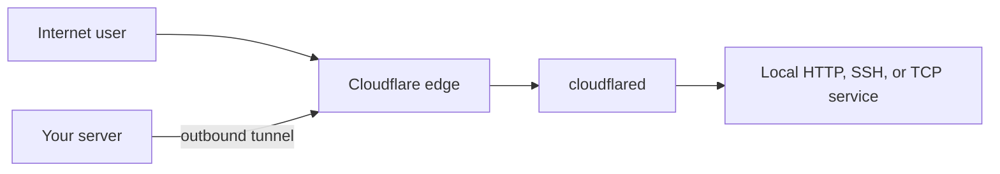

# Cloudflare Tunnel Manager

<p align="center">
  
</p>

<p align="center">
  
  
  
</p>

`cftunnel` is a small, opinionated CLI for exposing services through Cloudflare Tunnel without hand-writing YAML, DNS routes, or systemd units.

Its goal is simple: make each tunnel easy to understand, isolated by DNS zone, safe to operate, and boring to recover.

## The idea



Your server connects outward to Cloudflare, so the local application does not need a directly exposed inbound port. cftunnel coordinates the Cloudflare tunnel, hostname route, local credentials, YAML configuration, and hardened systemd service.

## What makes it different

- **One tunnel, one config, one service** — every tunnel has its own private YAML and systemd instance.
- **Zone isolation** — each Cloudflare DNS zone keeps separate configuration and bound management credentials.
- **Safe defaults** — hostname containment, private file modes, fail-closed removal, and crash-recoverable credential refresh.
- **Automatic routing** — creates the Cloudflare tunnel and DNS route, with `--no-dns` when DNS is managed elsewhere.
- **Local truth** — `cftunnel list` reports routes from local YAML without requiring Cloudflare or network access.
- **Multiple origin types** — HTTP/HTTPS, SSH, and generic TCP services.

## A first look

```bash
git clone https://github.com/rodrigocnascimento/cf-tunnels.git
cd cf-tunnels
./install.sh

cftunnel zone use example.com
cftunnel zone login

cftunnel add \
  --hostname app.example.com \
  --type http \
  --service http://localhost:3000

cftunnel list
```

The normal lifecycle is:

1. Register a canonical Cloudflare zone locally.
2. Authenticate that zone and bind its credential metadata.
3. Add a hostname route to a local service.
4. Let cftunnel validate, configure DNS, and start the systemd unit.
5. Operate it with `list`, `status`, `logs`, `start`, `stop`, and `remove`.

## Requirements

- Linux with systemd
- Bash, `jq`, and `sudo`
- a Cloudflare account and active DNS zone
- `cloudflared` (the installer can install it)
- optional `dig` or `host`; DNS checks fall back to `getent`

## Documentation

The complete documentation lives in the **[cftunnel Wiki](https://github.com/rodrigocnascimento/cf-tunnels/wiki)**.

- [Getting Started](https://github.com/rodrigocnascimento/cf-tunnels/wiki/Getting-Started)
- [Set Up a New Domain](https://github.com/rodrigocnascimento/cf-tunnels/wiki/New-Domain-Setup)
- [CLI Reference](https://github.com/rodrigocnascimento/cf-tunnels/wiki/CLI-Reference)
- [Zones and Credentials](https://github.com/rodrigocnascimento/cf-tunnels/wiki/Zones-and-Credentials)
- [Tunnel Types](https://github.com/rodrigocnascimento/cf-tunnels/wiki/Tunnel-Types)
- [Operations and Troubleshooting](https://github.com/rodrigocnascimento/cf-tunnels/wiki/Operations-and-Troubleshooting)
- [Security Model](https://github.com/rodrigocnascimento/cf-tunnels/wiki/Security-Model)

## Project status

The project is actively evolving and intentionally targets a focused Linux/systemd workflow. Check [CHANGELOG.md](CHANGELOG.md) for releases and `cftunnel --version` for the installed application version.

## Contributing

Issues and pull requests are welcome. Run the shell syntax checks and the full test suite before submitting changes; the [development guide](https://github.com/rodrigocnascimento/cf-tunnels/wiki/Development-and-Testing) has the current workflow.

## License

[MIT](LICENSE)
