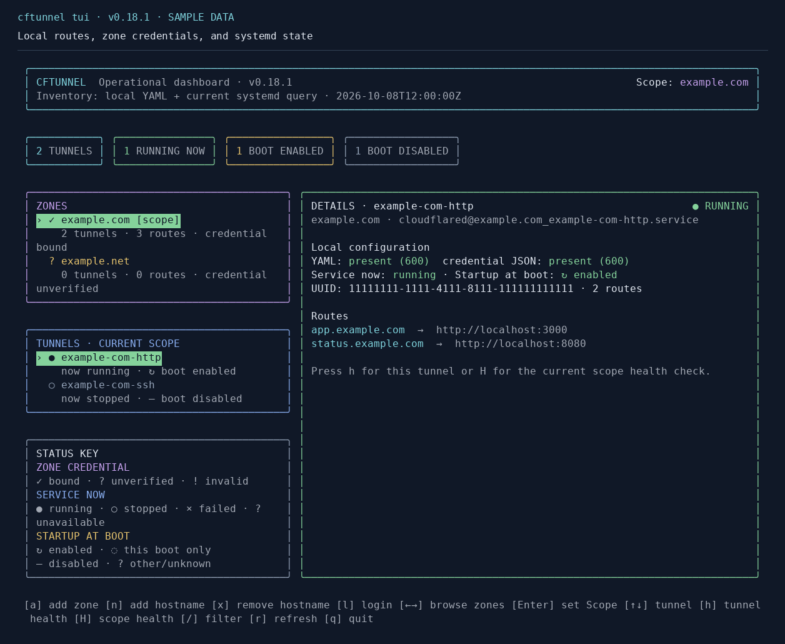
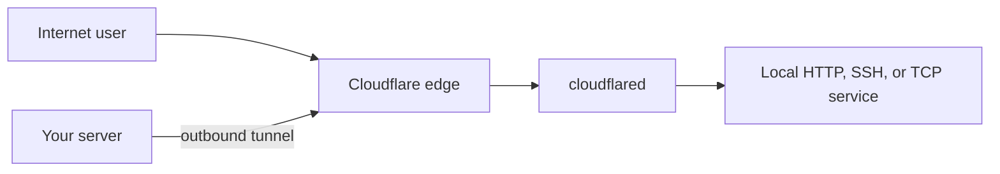

# cftunnel — Cloudflare Tunnel Manager

<p align="center">
  
</p>

<p align="center">
  
  
  
</p>

`cftunnel` is an open-source CLI and terminal dashboard for exposing and operating services through Cloudflare Tunnel on Linux. It coordinates hostname routes, private configuration, zone credentials, and systemd services so you can publish an application without assembling those pieces by hand.

Built for developers who run services on Linux servers, with HTTP/HTTPS, SSH, and TCP origins.

[](assets/cftunnel-demo.gif)

[Watch the 30-second dashboard demo](assets/cftunnel-demo.gif). Captured from the actual TUI with labeled sample data.

## The idea


```mermaid
flowchart LR
    User[Internet user] --> Edge[Cloudflare edge]
    Server[Your server] -->|outbound tunnel| Edge
    Edge --> CF[cloudflared]
    CF --> Service[Local HTTP, SSH, or TCP service]
```

Your server connects outward to Cloudflare, so the application does not need a directly exposed inbound port. Application authentication and Cloudflare Access policies remain your choice.

## What makes it different

- **One tunnel, one config, one service** — each tunnel has a private YAML and systemd instance; several hostnames can share a tunnel.
- **Zone isolation** — each Cloudflare DNS zone keeps separate configuration and bound management credentials.
- **Reviewed changes** — preview hostname changes with `--plan`; invalid hostnames and uncertain Cloudflare responses stop before applying changes.
- **Safe defaults** — private configuration, verified credential binding, recoverable credential refresh, and hardened systemd units.
- **Automatic routing** — creates the Cloudflare tunnel and DNS route, with `--no-dns` when DNS is managed elsewhere.
- **Visible state** — local routes, credential readiness, current service state, boot enablement, explicit health observations, and persistent activity logs in the TUI.
- **Scriptable and local** — JSON inventory contracts and offline route listing; the CLI remains usable alongside the dashboard.

## How to install

```bash
curl -fsSL https://raw.githubusercontent.com/rodrigocnascimento/cf-tunnels/main/install-cftunnel.sh | bash
```

## A first look

```bash
cftunnel zone use example.com
cftunnel zone login

cftunnel add \
  --hostname app.example.com \
  --type http \
  --service http://localhost:3000

cftunnel list
cftunnel tui
```

The installer detects Linux x64/ARM64, downloads the latest release bundle,
verifies its SHA-256 checksum, and installs it under your user account before
setting up the system command. Run it as your regular user; it requests sudo
only for system files. Zone authentication happens explicitly later with
`cftunnel zone login`. Release bundles include the production TUI and
activity-log runtime; Bun is not needed on the server. `cftunnel tui-dev` is
reserved for contributors using a source checkout.

Replace `example.com` with your active Cloudflare zone and use a listening local origin. Add `--plan` to preview a hostname change without applying it. The [Getting Started guide](https://github.com/rodrigocnascimento/cf-tunnels/wiki/Getting-Started) walks through a test origin, creation, inspection, and cleanup.

## Requirements

- Linux with systemd
- Bash, `jq`, and `sudo`
- a Cloudflare account and active DNS zone
- `cloudflared` (the installer can install it)
- `curl` or `wget`, `tar`, and `sha256sum` for the release installer
- `curl` or `wget` to download `cloudflared` when it is not already installed
- optional `dig` or `host`; DNS checks fall back to `getent`

Bun is only needed when building from a source checkout. The release bundle
contains a platform-specific runtime for `cftunnel tui` and `cftunnel log`.

## Documentation

The complete documentation lives in the **[cftunnel Wiki](https://github.com/rodrigocnascimento/cf-tunnels/wiki)**.

- [Getting Started](https://github.com/rodrigocnascimento/cf-tunnels/wiki/Getting-Started)
- [Installation and Updates](https://github.com/rodrigocnascimento/cf-tunnels/wiki/Installation)
- [Set Up a New Domain](https://github.com/rodrigocnascimento/cf-tunnels/wiki/New-Domain-Setup)
- [CLI Reference](https://github.com/rodrigocnascimento/cf-tunnels/wiki/CLI-Reference)
- [Zones and Credentials](https://github.com/rodrigocnascimento/cf-tunnels/wiki/Zones-and-Credentials)
- [Tunnel Types](https://github.com/rodrigocnascimento/cf-tunnels/wiki/Tunnel-Types)
- [Operations and Troubleshooting](https://github.com/rodrigocnascimento/cf-tunnels/wiki/Operations-and-Troubleshooting)
- [Operational TUI](https://github.com/rodrigocnascimento/cf-tunnels/wiki/Operational-TUI)
- [Activity Logs](https://github.com/rodrigocnascimento/cf-tunnels/wiki/Activity-Logs)
- [Security Model](https://github.com/rodrigocnascimento/cf-tunnels/wiki/Security-Model)

## Project status

Actively maintained and pre-1.0, with a focused Linux/systemd workflow. See [published releases](https://github.com/rodrigocnascimento/cf-tunnels/releases), [CHANGELOG.md](CHANGELOG.md), and `cftunnel --version`. The manager covers locally configured tunnels; it does not import remote-only tunnels or manage Cloudflare Access policies.

## Contributing

Issues and pull requests are welcome. Run the shell syntax checks and the full test suite before submitting changes; the [development guide](https://github.com/rodrigocnascimento/cf-tunnels/wiki/Development-and-Testing) has the current workflow.

## License

[MIT](LICENSE)
