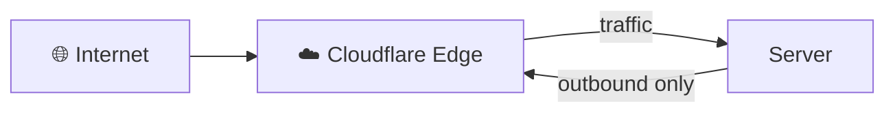

# Cloudflare Basics

This document explains the Cloudflare concepts you need to know to use this project.

---

## What is Cloudflare?

Cloudflare is a **CDN and security company** that sits between your server and the internet. It provides:

- 🚀 **Faster websites** - Content delivered from nearest datacenter
- 🔒 **DDoS protection** - Blocks attacks before they reach your server
- 🌐 **Edge network** - 300+ datacenters worldwide
- 🔐 **SSL/TLS** - Automatic encryption

---

## How Cloudflare Tunnels Work



- **Traditional hosting:** Open port 80/443 → hackers attack → server overwhelmed
- **With Cloudflare:** Server connects OUT → Cloudflare blocks attacks → safe!

> 💡 Your server connects **outbound only** to Cloudflare. No inbound ports needed!

---

## What You Need

### 1. Cloudflare Account

Sign up at: [dash.cloudflare.com](https://dash.cloudflare.com/)

### 2. A Domain

You need a domain you control. I buy mine from **Namecheap** because it's cheap and easy.

> 💡 **Important:** After buying the domain, you must set **Custom DNS** to Cloudflare's nameservers. This is a crucial step!

### 3. Domain Pointing to Cloudflare

Once you have a domain, change your DNS servers to Cloudflare:

1. Go to [dash.cloudflare.com](https://dash.cloudflare.com/)
2. Click "Add a Site"
3. Enter your domain
4. Cloudflare will give you nameservers like:
   ```
   elaine.ns.cloudflare.com
   henry.ns.cloudflare.com
   ```
5. Go to your domain registrar and replace their nameservers with Cloudflare's

### 4. Free Plan is Enough

Cloudflare's **free plan** includes:
- ✅ CDN
- ✅ SSL/TLS
- ✅ DDoS protection
- ✅ Cloudflare Tunnels
- ✅ 3 active tunnels

---

## Zero Trust (Optional)

Cloudflare Zero Trust adds **authentication** to your tunnels. Instead of anyone accessing your service, you can require:

- Google login
- GitHub login
- Email verification
- One-time passwords

### Enable Zero Trust

1. Go to [dash.cloudflare.com](https://dash.cloudflare.com/)
2. Click **Zero Trust** in the sidebar
3. Sign up for free (includes 50 users)
4. Create Access Policies for your tunnels

### When to Use Zero Trust

| Service | Recommended |
|---------|-------------|
| Public API | ❌ No (let everyone access) |
| Admin panels | ✅ Yes (restrict access) |
| Databases | ✅ Yes (restrict access) |
| Monitoring | ✅ Yes (restrict access) |
| SSH | ✅ Yes (security!) |

---

## Quick Setup Checklist

- [ ] Create Cloudflare account
- [ ] Add your domain to Cloudflare
- [ ] Update nameservers at your registrar
- [ ] Wait for DNS propagation (up to 24h)
- [ ] Verify DNS: `dig @1.1.1.1 +short api.example.com` (uses Cloudflare's resolver) or `getent ahosts api.example.com` (built-in fallback)
- [ ] Install cloudflared: `cloudflared tunnel login`
- [ ] Create tunnels: `cftunnel add --hostname api.example.com --type http --service http://localhost:3000`

---

## Links

| Resource | URL |
|----------|-----|
| Dashboard | https://dash.cloudflare.com/ |
| Tunnels Docs | https://developers.cloudflare.com/cloudflare-one/connections/connect-networks/ |
| Zero Trust | https://www.cloudflare.com/zero-trust/ |
| Community | https://community.cloudflare.com/ |

---

## TL;DR

1. **Cloudflare** = CDN + Security + Tunnels
2. **Tunnels** = Expose local services without opening ports
3. **DNS** = Point your domain to Cloudflare
4. **Zero Trust** = Add login requirement (optional)
5. **Free plan** = Good enough for most use cases

That's it! Now you understand the basics. 🚀
