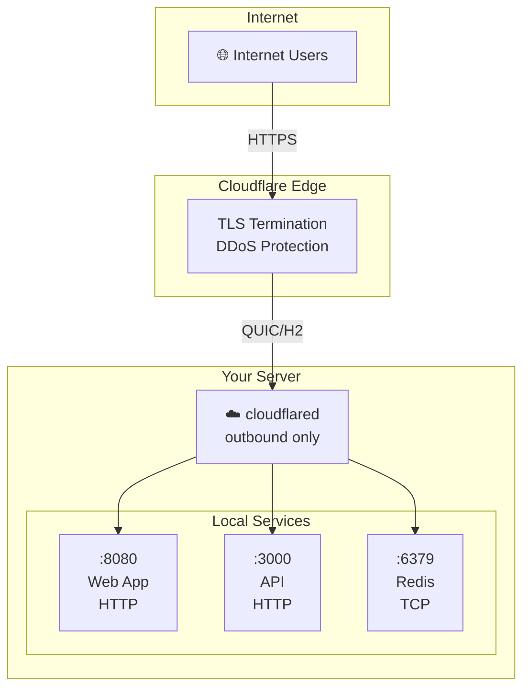
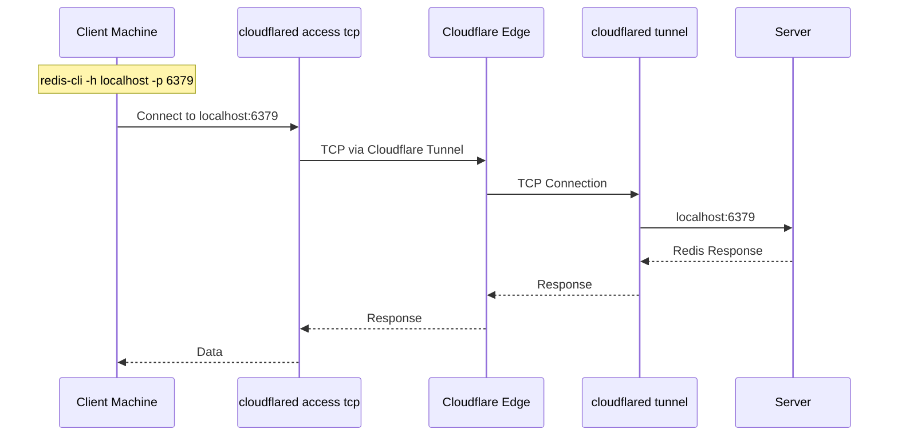

# Cloudflare Tunnel Manager - Technical Documentation

> Complete reference for deploying, operating, and managing Cloudflare Tunnels with the `cftunnel` tool.

---

## Table of Contents

1. [What is a Cloudflare Tunnel?](#what-is-a-cloudflare-tunnel)
2. [Architecture](#architecture)
3. [Prerequisites](#prerequisites)
4. [Installation](#installation)
5. [Project Structure](#project-structure)
6. [CLI Reference](#cli-reference)
7. [Tunnel Types](#tunnel-types)
8. [Configuration](#configuration)
9. [systemd Services](#systemd-services)
10. [Common Use Cases](#common-use-cases)
11. [Monitoring](#monitoring)
12. [Security](#security)
13. [Troubleshooting](#troubleshooting)

---

## What is a Cloudflare Tunnel?

A Cloudflare Tunnel creates a **secure outbound connection** from your server to Cloudflare's edge network. This allows you to expose local services to the internet **without opening inbound ports** on your firewall.

### Key Benefits

| Benefit | Description |
|---------|-------------|
| 🔒 **No Inbound Ports** | Server connects OUT to Cloudflare, no firewall rules needed |
| 🌍 **Global Edge** | Traffic served from nearest Cloudflare datacenter |
| ⚡ **Fast** | Uses QUIC protocol for low latency |
| 🔐 **Encrypted** | All traffic is encrypted end-to-end |
| 🛡️ **Protected** | DDoS protection, bot management built-in |

---

## Architecture



### How It Works

1. `cloudflared` process starts on your server
2. It establishes an **outbound** QUIC connection to Cloudflare's edge
3. Cloudflare creates a public hostname (CNAME to `*.cfargotunnel.com`)
4. When users visit your hostname, Cloudflare routes traffic through the tunnel
5. Traffic flows: User → Cloudflare Edge → cloudflared → Your Service

---

## Prerequisites

| Requirement | Command |
|-------------|---------|
| Linux/macOS/WSL2 | - |
| `cloudflared` | [Install Guide](https://developers.cloudflare.com/cloudflare-one/connections/connect-apps/install-and-setup/installation/) |
| `jq` | `sudo apt install jq` (Debian/Ubuntu) |
| `systemd` | Pre-installed on most Linux distros |
| `sudo` access | Pre-installed |
| `dig` (optional) | `sudo apt install bind-tools` (Debian) ou `sudo apt install dnsutils` (Ubuntu). Fallback automático para `getent ahosts` (built-in) se ausente. |
| Cloudflare account | [Sign Up Free](https://dash.cloudflare.com/) |

### Install cloudflared

```bash
# Download latest release
sudo wget -O /usr/local/bin/cloudflared \
  https://github.com/cloudflare/cloudflared/releases/latest/download/cloudflared-linux-amd64

# Make executable
sudo chmod +x /usr/local/bin/cloudflared

# Verify
cloudflared --version
```

---

## Related Guides

- **[Setting Up a New Domain](SETUP-NEW-DOMAIN.md)** — Complete walkthrough from domain purchase to live tunnels
- **[Cloudflare Basics](CLOUDFLARE.md)** — Cloudflare concepts explained

---

## Installation

### Option 1: Use the Installer (Recommended)

```bash
git clone https://github.com/yourrepo/cf-tunnels.git
cd cf-tunnels
chmod +x install.sh
./install.sh
```

The installer will:
- ✅ Install cloudflared if missing
- ✅ Authenticate with Cloudflare
- ✅ Create systemd template
- ✅ Set up directories
- ✅ Create `cftunnel` command

### Option 2: Manual Setup

```bash
# 1. Authenticate
cloudflared tunnel login

# 2. Create systemd template
sudo tee /etc/systemd/system/cloudflared@.service > /dev/null <<EOF
[Unit]
Description=Cloudflare Tunnel (%i)
After=network-online.target
Wants=network-online.target

[Service]
Type=simple
User=YOUR_USERNAME
WorkingDirectory=/home/YOUR_USERNAME
ExecStart=/usr/local/bin/cloudflared tunnel --config /home/YOUR_USERNAME/.cloudflared/%i.yml run
Restart=on-failure
RestartSec=2
StartLimitIntervalSec=30
StartLimitBurst=5
StandardOutput=journal
StandardError=journal

# Reduce logging verbosity
Environment="CLOUDFLARED_LOGLEVEL=info"

# Security: systemd sandbox
NoNewPrivileges=true
PrivateTmp=true
RestrictAddressFamilies=AF_INET AF_INET6
RestrictRealtime=true
MemoryMax=256M
LimitNOFILE=65536

[Install]
WantedBy=multi-user.target
EOF

# 3. Reload systemd
sudo systemctl daemon-reload

# 4. Make run.sh executable
chmod +x run.sh
```

---

## Project Structure

```
cf-tunnels/                          # Project root
├── run.sh                          # Main CLI tool (cftunnel)
├── install.sh                      # Installer script
├── uninstall.sh                    # Uninstaller script
├── prompt-hook.sh                  # Shell prompt indicator
├── cf-ssh-diagnose.zsh             # SSH diagnostics
├── README.md                       # User guide
├── docs/
│   ├── DOCS.md                     # This file
│   ├── MIGRATION.md                # v0.2.0 → v0.3.0 migration guide
│   └── CLOUDFLARE.md               # Cloudflare basics
├── tests/                          # Test suite
│   ├── run.sh                      # Test runner
│   └── ...
├── assets/
│   └── logo.png                    # Project logo
├── CHANGELOG.md                    # Version history
└── LICENSE                         # MIT License

~/.cloudflared/                     # Cloudflare config (on your server)
├── cert.pem                        # Authentication certificate (fallback)
├── .default_zone                   # Active default zone name (v0.3.0+)
├── <UUID>.json                     # Legacy tunnel credentials (no zone)
├── <tunnel-name>.yml               # Legacy tunnel configuration
└── zones/                          # Zone isolation (v0.3.0+)
    └── <domain>/
        ├── cert.pem                # Zone-specific cert (from zone login)
        ├── <UUID>.json
        ├── <tunnel-name>.yml
        └── zone.json               # Metadata
```

---

## CLI Reference

### Commands

| Command | Description | Example |
|---------|-------------|---------|
| `add` | Create new tunnel | `cftunnel add --hostname api.example.com --type http --service http://localhost:3000` |
| `add --no-dns` | Create tunnel without DNS | `cftunnel add --hostname db.example.com --type tcp --service tcp://localhost:5432 --no-dns` |
| `remove` | Delete tunnel | `cftunnel remove --name api-example-com-http` |
| `start` | Start tunnel | `cftunnel start --name my-tunnel` |
| `stop` | Stop tunnel | `cftunnel stop --name my-tunnel` |
| `status` | Show status | `cftunnel status --name my-tunnel` |
| `logs` | View logs | `cftunnel logs --name my-tunnel` |
| `list` | List local hostname routes in the active zone, or all local zones if none is active | `cftunnel list` |
| `zone` | Manage persistent default zone and authentication | `cftunnel zone use homelaberson.space` |
| `cli-update` | Update cloudflared binary | `cftunnel cli-update` |

### Zone Commands

| Subcommand | Description | Example |
|------------|-------------|---------|
| `zone use <name>` | Set persistent default zone | `cftunnel zone use homelaberson.space` |
| `zone current` | Show active default zone | `cftunnel zone current` |
| `zone unset` | Clear default zone | `cftunnel zone unset` |
| `zone login` | Authenticate and save cert to active zone | `cftunnel zone login` |

### Global Flags

| Flag | Description | Example |
|------|-------------|---------|
| `--zone <name>` | Operate within a specific zone (can appear anywhere) | `cftunnel --zone testes.lat add ...` |
| `--persist` | Save `--zone` as the new default | `cftunnel --zone testes.lat --persist` |

### Flags for `add`

| Flag | Required | Description | Example |
|------|----------|-------------|---------|
| `--hostname` | ✅ Yes | Full domain to expose | `api.example.com` |
| `--type` | ✅ Yes | Protocol type | `http`, `ssh`, `tcp` |
| `--service` | ✅ Yes | Local service URL | `http://localhost:3000` |
| `--name` | No | Custom tunnel name | `my-api` (default: `{domain}-{type}`) |
| `--no-dns` | No | Skip automatic DNS CNAME creation | Use when DNS is managed externally |
| `--zone` | No | Create in a specific zone | `cftunnel add ... --zone homelaberson.space` |

### Service URL Formats

| Protocol | Format | Example |
|----------|--------|---------|
| HTTP | `http://localhost:<port>` | `http://localhost:8080` |
| HTTPS | `https://localhost:<port>` | `https://localhost:443` |
| SSH | `ssh://localhost:<port>` | `ssh://localhost:22` |
| TCP | `tcp://localhost:<port>` | `tcp://localhost:6379` |

---

## Tunnel Types

### HTTP/HTTPS Tunnels

**Best for:** Web apps, APIs, admin panels, dashboards

```bash
# Expose a web application
cftunnel add \
  --hostname api.YOUR_DOMAIN.com \
  --type http \
  --service http://localhost:3000
```

**Access:** Users visit `https://api.YOUR_DOMAIN.com` directly.

---

### SSH Tunnels

**Best for:** Secure remote server access without exposing port 22

```bash
# Create SSH tunnel
cftunnel add \
  --hostname ssh.YOUR_DOMAIN.com \
  --type ssh \
  --service ssh://localhost:22
```

**Access from client:**

```bash
# Method 1: Using cloudflared
cloudflared access ssh --hostname ssh.YOUR_DOMAIN.com

# Method 2: Using SSH with proxy
ssh -o "ProxyCommand cloudflared access tcp --hostname ssh.YOUR_DOMAIN.com --url localhost:22" user@host
```

---

### TCP Tunnels (Databases, Redis, etc.)

> ⚠️ **IMPORTANT:** TCP tunnels require `cloudflared access tcp` on the client side.

Cloudflare's edge only handles HTTP/HTTPS directly. For TCP services, the client must create a local endpoint.

**How TCP Tunnels Work:**



**Step-by-Step:**

**1. On SERVER - Create the tunnel:**

```bash
cftunnel add \
  --hostname redis.YOUR_DOMAIN.com \
  --type tcp \
  --service tcp://localhost:6379
```

**2. On CLIENT - Install cloudflared:**

```bash
sudo wget -O /usr/local/bin/cloudflared \
  https://github.com/cloudflare/cloudflared/releases/latest/download/cloudflared-linux-amd64
sudo chmod +x /usr/local/bin/cloudflared
```

**3. On CLIENT - Start the TCP access tunnel:**

```bash
cloudflared access tcp \
  --hostname redis.YOUR_DOMAIN.com \
  --url localhost:6379
```

**4. On CLIENT - Connect your app:**

```bash
# Redis CLI
redis-cli -h localhost -p 6379

# In your app
redis://localhost:6379
```

### Common TCP Services

| Service | Default Port | Example |
|---------|-------------|---------|
| Redis | 6379 | `tcp://localhost:6379` |
| PostgreSQL | 5432 | `tcp://localhost:5432` |
| MySQL | 3306 | `tcp://localhost:3306` |
| MongoDB | 27017 | `tcp://localhost:27017` |
| SMTP | 25/587 | `tcp://localhost:587` |
| RDP | 3389 | `tcp://localhost:3389` |

---

## Configuration

### YAML Config File

Each tunnel has a config file at `~/.cloudflared/<tunnel-name>.yml`:

```yaml
# Tunnel identification
tunnel: YOUR-TUNNEL-UUID-HERE
credentials-file: /home/user/.cloudflared/YOUR-TUNNEL-UUID-HERE.json

# Connection settings
protocol: http2
edge-ip-version: 4

# Origin request settings
originRequest:
  tcpKeepAlive: 30s
  keepAliveTimeout: 2m
  connectTimeout: 10s

# Ingress rules (routing)
ingress:
  - hostname: "api.example.com"
    service: http://localhost:3000
  - hostname: "*.example.com"
    service: http://localhost:8080
  - service: http_status:404
```

### Configuration Options

| Option | Default | Description |
|--------|---------|-------------|
| `protocol` | `http2` | Protocol to use (`http2` or `h2mux`) |
| `edge-ip-version` | `4` | IP version (`4`, `6`, or `auto`) |
| `tcpKeepAlive` | `30s` | TCP keepalive interval |
| `keepAliveTimeout` | `2m` | Connection idle timeout |
| `connectTimeout` | `10s` | Origin connection timeout |

---

## systemd Services

### Service Naming

**Without zone:**
```
cloudflared@<tunnel-name>.service
```

**With zone:**
```
cloudflared@<zone-slug>_<tunnel-name>.service
```

For example:
- Tunnel named `api-example-com-http` (no zone) → Service `cloudflared@api-example-com-http.service`
- Tunnel named `api-example-com-http` in zone `homelaberson.space` → Service `cloudflared@homelaberson.space_api-example-com-http.service`
- Config file: `~/.cloudflared/zones/homelaberson.space/api-example-com-http.yml`

### Service Commands

```bash
# Start
sudo systemctl start cloudflared@<name>

# Stop
sudo systemctl stop cloudflared@<name>

# Restart
sudo systemctl restart cloudflared@<name>

# Status
sudo systemctl status cloudflared@<name>

# Enable on boot
sudo systemctl enable cloudflared@<name>

# View logs
sudo journalctl -fu cloudflared@<name>

# View recent logs
sudo journalctl -fu cloudflared@<name> --since "1 hour ago"
```

### Manage All Tunnels

```bash
# List all
systemctl list-units 'cloudflared@*'

# Restart all
systemctl list-units 'cloudflared@*' --no-legend | awk '{print $1}' | \
  xargs -I{} sudo systemctl restart {}

# Stop all
sudo systemctl stop 'cloudflared@*'

# Start all
sudo systemctl start 'cloudflared@*'
```

---

## Common Use Cases

### 1. Expose a Web API

```bash
# Start your API
cd /path/to/your/api
npm start &

# Create tunnel
cftunnel add \
  --hostname api.YOUR_DOMAIN.com \
  --type http \
  --service http://localhost:3000

# Test
curl https://api.YOUR_DOMAIN.com
```

### 2. Access PostgreSQL Remotely

```bash
# SERVER: Create tunnel
cftunnel add \
  --hostname postgres.YOUR_DOMAIN.com \
  --type tcp \
  --service tcp://localhost:5432

# CLIENT: Access
cloudflared access tcp --hostname postgres.YOUR_DOMAIN.com --url localhost:5432

# CLIENT: Connect
psql -h localhost -p 5432 -U postgres
```

### 3. Home Lab Dashboard

```bash
# Portainer
cftunnel add \
  --hostname portainer.YOUR_DOMAIN.com \
  --type http \
  --service http://localhost:9000

# Grafana
cftunnel add \
  --hostname grafana.YOUR_DOMAIN.com \
  --type http \
  --service http://localhost:3000

# Prometheus
cftunnel add \
  --hostname prometheus.YOUR_DOMAIN.com \
  --type http \
  --service http://localhost:9090
```

### 4. SSH Access to Remote Server

```bash
# SERVER: Create tunnel
cftunnel add \
  --hostname work-server.YOUR_DOMAIN.com \
  --type ssh \
  --service ssh://localhost:22

# CLIENT: Access
cloudflared access ssh --hostname work-server.YOUR_DOMAIN.com
```

---

## Prompt Hook

The `prompt-hook.sh` script shows the active cftunnel zone in your shell prompt — similar to Python venv's `(venv)` prefix.

### Behavior

| Shell / Theme | Result |
|---------------|--------|
| Plain bash/zsh | `🚇[homelaberson.space] user@host:~$` |
| With p10k | `🚇[homelaberson.space] ~/projects` (via `POWERLEVEL9K_DIR_PREFIX`) |
| With oh-my-zsh | Use `CFTUNNEL_ZONE` variable in your theme |

### Installation

The installer (`install.sh`) automatically adds the hook to `~/.bashrc` and `~/.zshrc`:

```bash
# >>> cftunnel installer <<<
source "/path/to/cf-tunnels/prompt-hook.sh"
# <<< cftunnel installer <<<
```

### Manual Setup

```bash
# Add to ~/.bashrc or ~/.zshrc:
source /path/to/cf-tunnels/prompt-hook.sh
```

### Override Modes

Set `CFTUNNEL_PROMPT_MODE` **before** sourcing:

| Mode | Behavior |
|------|----------|
| `auto` (default) | Detects p10k and adapts |
| `prefix` | Always prefix `PS1`/`PROMPT` directly |
| `none` | Only set `CFTUNNEL_ZONE` variable (for custom themes) |
| `dir_prefix` | Force p10k `DIR_PREFIX` |
| `dir_suffix` | Force p10k `DIR_SUFFIX` |

Example for custom theme:

```bash
export CFTUNNEL_PROMPT_MODE=none
source /path/to/cf-tunnels/prompt-hook.sh
# Now use $CFTUNNEL_ZONE in your own theme config
```

## Monitoring

### Check Tunnel Status

```bash
# Using cftunnel
cftunnel list

# Using systemd
systemctl list-units 'cloudflared@*'
```

### Check DNS Resolution

```bash
# Should return: <uuid>.cfargotunnel.com
dig @1.1.1.1 +short api.YOUR_DOMAIN.com
```

### View Real-Time Logs

```bash
# All tunnels
sudo journalctl -u 'cloudflared@*' -f

# Specific tunnel
sudo journalctl -fu cloudflared@<name> -f
```

### Cloudflare Dashboard

Visit: https://dash.cloudflare.com/

Navigate: **Zero Trust** → **Networks** → **Tunnels**

---

## Security

### Protect Sensitive Files

```bash
# YAML files are automatically set to 600 by the script.
# For existing files, apply manually:
chmod 600 ~/.cloudflared/cert.pem
chmod 600 ~/.cloudflared/*.json
chmod 600 ~/.cloudflared/*.yml
```

### Systemd Sandbox

The systemd template includes hardening directives that restrict the `cloudflared` process:

| Directive | Effect |
|-----------|--------|
| `NoNewPrivileges=true` | Prevents privilege escalation via setuid/setgid |
| `PrivateTmp=true` | Isolates `/tmp` per service instance |
| `RestrictAddressFamilies=AF_INET AF_INET6` | Only IP sockets allowed |
| `RestrictRealtime=true` | Blocks realtime scheduling |
| `MemoryMax=256M` | Hard memory ceiling |
| `LimitNOFILE=65536` | File descriptor limit for concurrent connections |
| `Restart=on-failure` | Restart only on crash, not on clean stop |
| `StartLimitIntervalSec=30` / `StartLimitBurst=5` | Caps restart storms at 5 failures in 30s |

### Use Cloudflare Access

1. Go to [Zero Trust Dashboard](https://dash.cloudflare.com/)
2. **Access** → **Applications** → **Create an application**
3. Select **Self-hosted**
4. Add your hostname
5. Configure authentication (Google, GitHub, etc.)
6. Set access policies

### Best Practices

| Practice | Why |
|----------|-----|
| Use Cloudflare Access | Adds OAuth authentication |
| Keep cert.pem secure | Your Cloudflare authentication |
| Use HTTPS internally | Encrypt local traffic |
| Monitor logs | Detect suspicious access |
| Regular updates | Security patches |

### No Firewall Rules Needed

Cloudflare Tunnels are **outbound-only**:
- Your server initiates the connection to Cloudflare
- No inbound ports need to be opened
- Works behind NAT, firewall, restrictive networks

---

## Troubleshooting

### Tunnel Won't Start

```bash
# 1. Check service status
systemctl status cloudflared@<name>

# 2. View logs
sudo journalctl -fu cloudflared@<name> --since "10 minutes ago"

# 3. Validate config
cloudflared tunnel --config ~/.cloudflared/<name>.yml ingress validate

# 4. Check if port is in use
sudo netstat -tlnp | grep <port>
```

### DNS Not Resolving

```bash
# O script usa dig por padrão (Tier 1), com fallback automático para:
#   Tier 2: host (CNAME) → Tier 3: getent ahosts (apenas IP, built-in)
# Para verificar manualmente:

# Check with Cloudflare DNS (most reliable)
dig @1.1.1.1 +short api.YOUR_DOMAIN.com

# Se dig não estiver instalado:
host api.YOUR_DOMAIN.com
# ou (built-in, sem dependências):
getent ahosts api.YOUR_DOMAIN.com

# Expected result: <uuid>.cfargotunnel.com
```

### Common Errors

| Error | Cause | Solution |
|-------|-------|----------|
| `credentials file not found` | Missing auth | Run `cloudflared tunnel login` |
| `DNS record already exists` | CNAME conflict | Delete existing DNS record in Cloudflare dashboard |
| `connection refused` | Service not running | Start your local service |
| `502 Bad Gateway` | Service not responding | Check service is running and accessible |
| `Authentication required` | Access policy enabled | Configure Access or disable policy |
| `list` shows no hostname routes | The active zone has no YAML ingress hostnames | Select the correct zone or run `cftunnel zone unset` to scan every local zone |
| Prompt hook not showing | Hook not installed | Re-run `./install.sh` or source `prompt-hook.sh` manually |
| Prompt hook broke theme | Conflict with p10k / oh-my-zsh | Set `CFTUNNEL_PROMPT_MODE=none` before sourcing |

### Reset Tunnel

```bash
# Stop, remove, and recreate
cftunnel stop --name <name>
cftunnel remove --name <name>
cftunnel add --hostname api.YOUR_DOMAIN.com --type http --service http://localhost:3000
```

---

## License

MIT License - See [LICENSE](../LICENSE) for details.
